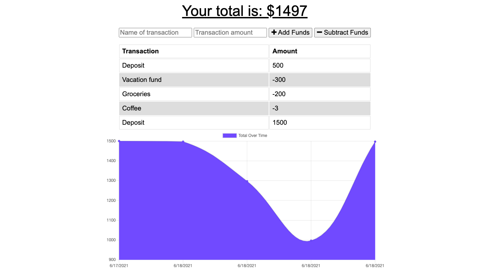

# Budget Tracker

## Description 
For this project I worked with starter code to create an online/offline budget tracker app. It utilizes HTML, CSS, Javascript, MongoDB, Mongoose and Service Workers. 

## Demo

## Table of Contents 
    
* [Installation](#installation)
* [Usage](#usage)
* [License](#license)
* [Contributing](#contributing)
* [Tests](#tests)
* [Questions](#questions)
    
    
## Installation Instructions 
To install dependancies and start this application run the following commands:
`npm i` 
`npm start`
## Usage 
This application allows the user to track their budget and spending both on and off line. 
## License 
This project is licensed with MIT
## Contributors 
Kirsten Nelson
## Tests 
No tests needed for this application
## Questions 
 For questions contact Kirsten Nelson at https://github.com/kirmarnel 